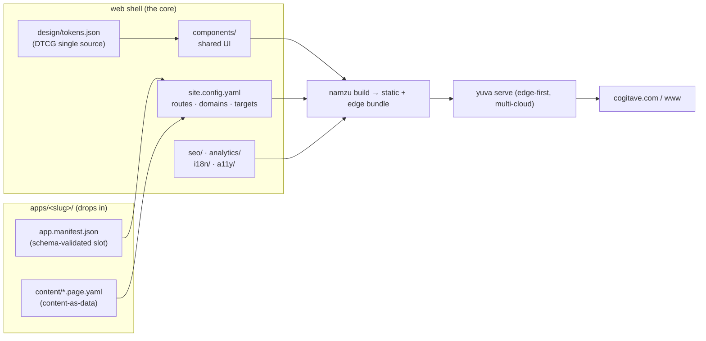

# web — marketing/web platform shell

This is the **core**, and it now carries its first app. It is the source of the
`marketing-site` property (cogitave.com / www in [`cogitave/bootstrap/domains.yaml`](../bootstrap/domains.yaml)).
The shell is structure + configs + conventions + the build; a finished site is
assembled by *dropping apps in*. The homepage,
[`apps/corporate-landing/`](apps/corporate-landing/), is the worked example of
that — read it before authoring a second app.

## Build and develop

```bash
npm run build         # static bundle -> _site/
npm run check         # build + drift gate - the CI gate
npm run dev           # dev server on :4173 with live reload
npm run sync:estate   # refresh the projections (estate only, see below)
```

No dependencies to install: the build is Node >= 22 and the standard library
only. `npm run dev` watches content, components, schemas and the projections,
rebuilds in tens of milliseconds, and pushes a reload over SSE; a build failure
shows as an error overlay in the browser rather than serving a stale page.

### This repo stands alone

`npm run build` works in a standalone clone of `cogitave/web`, with no estate
around it — verified by building an extracted copy and diffing the output.

That matters because two inputs are authored in **private** repos: the published
prices (`corp/gtm`) and the DTCG design tokens (`cogitave/design`). A public
repo's build must not read a private tree — it breaks the moment the repo is
cloned by itself, and it couples public output to private data. So the estate
holds the canonical sources and [`tools/sync-estate.mjs`](tools/sync-estate.mjs)
writes committed **projections** into this repo:

| Projection | Canonical source |
|---|---|
| [`content/pricing/services-catalog.published.yaml`](content/pricing/) | `corp/gtm/pricing/services-catalog.yaml` |
| [`design/tokens.json`](design/) | `cogitave/design/tokens.json` |

Only what the site already exposes crosses: prices printed on the page, token
values that reach the stylesheet anyway. Engagement types, SLA profiles and
internal pricing notes stay in corp.

`npm run check` fails if a projection has gone stale — but **only where the
canonical source is reachable**. In a standalone clone it says so explicitly
rather than passing quietly, so a green check never implies a comparison that did
not happen.

> [!NOTE]
> Build-from-scratch ethos applies (see [ADR-0003 in standards](../standards/docs/decisions/0003-build-from-scratch-reference-not-dependency.md)).
> The engines are ours (`namzu`/TS build, `yuva`/Rust serve). Off-the-shelf
> specs — DTCG design tokens, schema.org, MCP, dotenvx — are **reference/spec,
> not lock-in**. English only.

## What this is

A vertically integrated marketing platform with one **single source** per
concern: tokens in `design/`, content as typed data in each app's `content/`,
domains mirrored from `cogitave/bootstrap/domains.yaml`, everything wired by
[`site.config.yaml`](site.config.yaml). Humans and agents read the same model
(MCP-native, like the rest of the estate).

## Architecture at a glance

The shell provides the **frame** (routing, render targets, shared components,
SEO/analytics/i18n/a11y defaults, design tokens). Each app provides **content +
a manifest**. Per [diagrams standard](../standards/docs/standards/diagrams.md),
this is a C4-style container view; **viewpoint: structural / build-time
composition; concern: how an app composes into the shell.**



`learn.cogitave.com` / `docs.cogitave.com` are a **separate** property
(`learn-platform`, built from [`cogitave/learn`](../learn/)); we cross-link to it,
we do not route it.

## The slot — how an app/page/campaign drops in

The convention is a folder + a validated manifest. **No shell code changes.**

1. **Copy the template:** `apps/_template/` → `apps/<your-app>/`.
2. **Edit the manifest:** `apps/<your-app>/app.manifest.json` — set `id`,
   `kind` (`app` | `landing` | `campaign`), `route`, `render.mode`
   (`static` | `island` | `edge-ssr`), `content.root`, `components`, `seo`,
   `i18n`, `analytics.events`, `owner`, `status`. It validates against
   [`apps/app.manifest.schema.json`](apps/app.manifest.schema.json) (blocking CI gate).
3. **Write content as data:** typed `*.page.yaml` under `content/`, validated by
   [`content/schemas/page.schema.json`](content/schemas/page.schema.json). Prose
   lives in separate `includes/*.md` (docs convention).
4. **Register the route:** add one line to `apps.registry` in
   [`site.config.yaml`](site.config.yaml) (discovery is automatic; the registry
   pins route/property/status and lets you stage or feature-flag).
5. **Ship:** CI validates manifest + content schemas, a11y, SEO, token usage, and
   perf budgets; the edge-first, multi-cloud deploy picks the app up.

Full walkthrough: [`docs/adding-an-app.md`](docs/adding-an-app.md).

## Directory map

| Path | What it holds |
|---|---|
| [`site.config.yaml`](site.config.yaml) | Routes/apps registry, domain mapping, build/deploy targets, env (dotenvx). |
| [`apps/`](apps/) | Drop-in apps / landing pages / campaigns. `_template/` to copy; `app.manifest.schema.json` is the slot contract. |
| [`components/`](components/) | Shared, token-driven UI; each component owns a content sub-schema. |
| [`content/`](content/) | Content-as-data model + schemas (sourced like the docs/learn model). |
| [`design/`](design/) | Design tokens ([`tokens.json`](../design/tokens.json), DTCG) + brand usage — the design-system single source. |
| [`seo/`](seo/) | Metadata, sitemap, `robots.txt`, structured data (JSON-LD), `llms.txt`. |
| [`analytics/`](analytics/) | Privacy-respecting, consent-gated analytics ([`consent.config.json`](analytics/consent.config.json)). |
| [`i18n/`](i18n/) | Locale routing: subdirectory, default locale unprefixed, never an automatic redirect ([ADR-0003](docs/decisions/0003-locale-routing.md)). |
| [`a11y/`](a11y/) | WCAG 2.2 AA notes + CI gates. |
| [`assets/`](assets/) | Static media served as-is: brand marks, third-party logos, and the self-hosted web faces ([`assets/fonts/README.md`](assets/fonts/README.md) records what they are and the licence position). |
| [`tools/`](tools/) | The build (`build.mjs`), the dev server with live reload (`serve.mjs`), and `lib/` — our YAML subset parser, DTCG token transform, JSON Schema validator, HTML emitter and analytics generator. Zero dependencies. |
| [`docs/`](docs/) | [architecture](docs/architecture.md), [adding-an-app](docs/adding-an-app.md), [ADRs](docs/decisions/). |

## Standards this shell follows

- **Docs-as-code / front matter:** every markdown doc here carries the
  [documentation standard](../standards/docs/standards/documentation.md)
  front matter; configs are schema-validated.
- **Diagrams-as-code:** Mermaid inline, each declaring its 42010 viewpoint
  ([diagrams standard](../standards/docs/standards/diagrams.md)).
- **MCP-native, certification-grade, English-only**, per the org
  [AGENTS.md](../../AGENTS.md).
